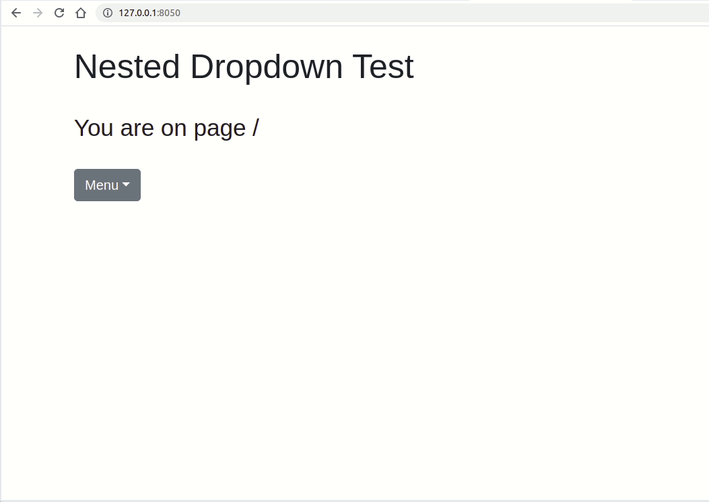

# NestedDropdownMenu

This component is an extension of (and built using) the simple [DropdownMenu](https://dash-bootstrap-components.opensource.faculty.ai/docs/components/dropdown_menu/) already offered by [Dash Bootstrap Components](https://github.com/facultyai/dash-bootstrap-components).

During one of our [`dash`](https://dash.plotly.com/introduction) projects at [Think-it](https://think-it.io/), we needed a dropdown that supports multiple levels unlike the offered one-dimensional menu.

Note that the simple `DropdownMenu` component is opened with a click, and we wanted a nested dropdown element that we can navigate with a mouse hover the thing that led us to start this side project.  
We then decided to share this component with the world by open-sourcing it to (hopefully) be included in the component library.

# Project Organization

```
.
├── assets                     <- contains static files (CSS/JS files)
│   ├── nested_dropdown.css    <- controls how would the component look like
│   └── nested_dropdown.js     <- controls how would the component behave on the front-end
├── main.py                    <- the script giving the output shown in the Demo section below
├── menu_structure.py          <- contains the structure of the menu
│                                 (sections and sub-sections in all levels, with all the labels and URL changes)
├── nested_dropdown_menu.py    <- contains the helper functions needed to generate the dropdown menu
├── README.md                  <- the file you're reading now
└── references.txt             <- contains the list of webpages we needed to implement this component
```

# Demo

As follows, a preview of how this new component would look like.

<p align="center">
  
</p>
